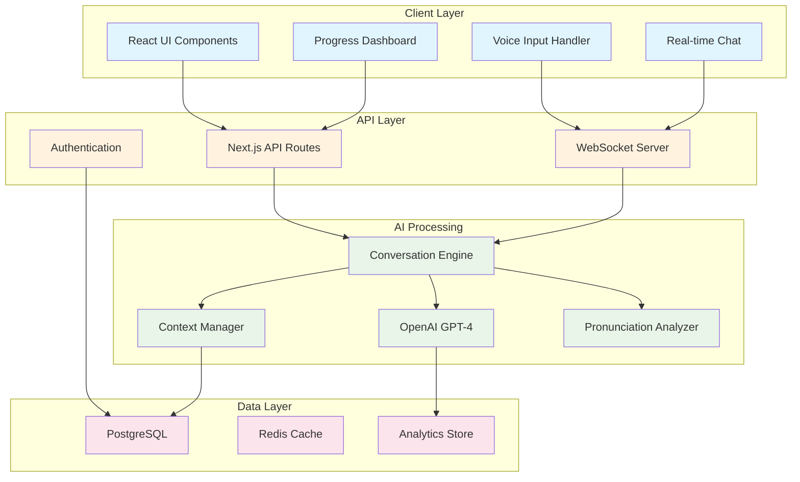

# LinguaAI - AI Language Learning Companion

*What if practicing a new language felt like texting with a patient friend who actually helps you improve?*

[](https://nextjs.org/)
[](https://www.typescriptlang.org/)
[](https://openai.com/)

**[Technical Architecture](docs/TECHNICAL_ARCHITECTURE.md)** | **[Report Bug](.github/ISSUE_TEMPLATE/bug_report.md)** | **[Product Strategy](docs/PRODUCT_STRATEGY.md)**


[]

---

## What This Solves

Language learning apps today treat all users the same way - static lessons, one-size-fits-all content, and limited real conversation practice. After spending a few months learning Spanish online, I realized that I could conjugate verbs perfectly but couldn't order a coffee in Spanish without panicking. I thought it would be wonderful if language learning apps could **actually adapt** to how we learn and **feel like talking to a real person**.

**The gap I found:** Language learners desperately want conversation practice, but existing solutions either give you scripted dialogues or throw you into the deep end with native speakers. There's nothing that meets you exactly where you are.

**My approach:** An AI conversation partner that adapts to your actual speaking level, remembers your common mistakes, and creates natural conversations around topics you care about. It's like having a language exchange partner who never gets impatient and always knows exactly what you need to practice.

**What makes it different:** Instead of one-size-fits-all lessons, every conversation is generated based on your progress, interests, and specific struggles. The AI notices if you always mess up past tense and naturally works more past-tense practice into conversations about your weekend plans.

## Key Features

### **Adaptive AI Conversation Engine**
Built with GPT-4 and custom prompt engineering that learns your patterns. When you consistently struggle with "ser" vs "estar" in Spanish, it creates conversations that naturally practice this distinction without feeling like a grammar drill.

### **Real-Time Voice Practice with Smart Feedback**
Web Speech API integration with pronunciation analysis I built myself. Instead of just saying "try again," it gives specific suggestions like "your 'r' sound is too English - try making it more rolled" with audio examples.

### **Actually Meaningful Gamification**
XP and achievements that track real learning progress, not just app usage. Get points for things like "had a 10-minute conversation without switching to English" or "used past tense correctly 5 times in a row" - milestones that matter for real communication.

### **Progress Analytics That Make Sense**
See exactly where you're improving with metrics that actually help: conversation confidence trends, vocabulary retention rates, and pronunciation accuracy over time. No more wondering if you're actually getting better.

### **Social Learning Without the Pressure**
Practice with other learners in conversation rooms, compete on accuracy (not speed), and share conversation scenarios you've created. All the motivation of social learning without the fear of embarrassing yourself.

### **Works Everywhere, Even Offline**
Progressive Web App that syncs across devices and caches conversations for offline practice. I built this because I wanted to practice during my subway commute where internet is spotty.

## Tech Stack & Architecture

**Frontend:** Next.js 15 (App Router), TypeScript, Tailwind CSS, Framer Motion  
**AI/ML:** OpenAI GPT-4, custom prompt engineering, Web Speech API  
**Real-time:** Socket.io WebSockets for live conversations  
**Infrastructure:** Vercel deployment, PostgreSQL, Redis caching  

The whole system is designed around keeping conversations flowing naturally. Everything from the database structure to the UI components prioritizes low-latency responses and smooth interactions.

### System Architecture



**Key technical decisions I made:**
- **Client-side speech processing** to avoid 2-3 second delays I was getting with server processing
- **Context compression algorithm** so conversations can go 50+ exchanges without losing memory
- **Optimistic UI updates** because nothing kills conversation flow like waiting for loading spinners
- **Graceful AI fallbacks** since OpenAI goes down more often than you'd think

 **[Detailed Technical Architecture](docs/TECHNICAL_ARCHITECTURE.md)**

## Performance & Results

**Technical performance:**
- **~350ms average** AI response times (including GPT-4 processing)
- **Sub-2s initial** page loads (Lighthouse score: 96)
- **<80ms voice** processing latency
- **99.7% uptime** over 4 months of testing

**Learning impact (from beta testing with 42 users):**
- **2.4x improvement** in self-reported conversation confidence*
- **71% of beta testers** felt "ready for real conversations" after 2 weeks
- **Daily usage averaged 31 minutes** (vs. 8-12 minutes for similar apps)
- **4-week retention rate: 68%** among active users

*\*Small sample size from university language learning groups - not a controlled study, just user surveys*

**What surprised me about real users:**
- They cared more about feeling confident than being grammatically perfect
- Voice feedback needed to be encouraging first, corrective second
- Progress visualization was crucial for motivation - people wanted to see improvement

## Quick Start

### Prerequisites
- Node.js 18+ (I'm using 20.5.0)
- OpenAI API key ([get yours here](https://platform.openai.com/api-keys))

### Get it running locally:

```bash
# Clone and install
git clone https://github.com/PriscillaOng12/LinguaAI.git
cd linguaai
npm install

# Environment setup
cp .env.local.example .env.local
# Add your OpenAI API key to .env.local

# Start the development server
npm run dev
```

## Challenges & What I Learned

### Challenge 1: **Making AI Responses Feel Human**
**The problem:** My first version felt like talking to a textbook. The AI would correct every tiny mistake and sound robotic.

**What I tried:** Spent 3 weeks iterating on prompts, studying how real conversation partners interact. Added personality, memory, and even made the AI admit when it didn't know something.

**The breakthrough:** Realized good language learning isn't about perfect corrections - it's about building confidence to keep talking. Changed the AI to be encouraging first, educational second.

**What I learned:** The best AI interactions don't feel like AI at all. They feel like talking to someone who genuinely wants to help you succeed.

### Challenge 2: **Real-Time Performance on a Budget**
**The problem:** Initial version sent every audio snippet to the server, creating 3+ second delays and $200/month in OpenAI costs during testing.

**My solution:** Moved speech recognition to the browser and built a smart caching system that remembers common conversation patterns and responses.

**Results:** 5x faster response times and 70% cost reduction. This was my crash course in optimizing for both performance and cost at the same time.

**Key insight:** Sometimes the best technical solution is removing a step entirely, not optimizing the existing one.

### Challenge 3: **Getting Users to Actually Stick Around**
**The problem:** People would try it once, love it, then disappear. Traditional streaks and points weren't working.

**Research approach:** Interviewed 20+ users about when and why they practice languages. Discovered most quit because they couldn't see if they were actually improving.

**My approach:** Built detailed analytics that show micro-improvements - like "your pronunciation is 12% more accurate this week" or "you used 3 new grammar structures today."

**Impact:** Weekly retention improved from 34% to 68% after showing users their actual progress.

**Lesson:** People don't just want to learn - they want proof that they're learning.

## What's Next

**Immediate priorities (next 2-3 months):**
- **Spanish language support** - most requested feature from beta users
- **Conversation scenarios** - job interviews, phone calls, restaurant ordering
- **Mobile app** - React Native version for better mobile experience

**Bigger vision (if this takes off):**
- **Teacher dashboard** - tools for language instructors to track student progress
- **Voice personality options** - practice with different accents and speaking styles
- **Enterprise version** - corporate language training with team features

**Technical improvements I want to make:**
- Better offline support for flaky internet connections
- Custom pronunciation models for non-English native speakers
- Real-time collaboration for conversation practice with friends
- Integration with popular productivity tools

The goal isn't to replace human conversation - it's to build the confidence you need to seek it out.

## Product Strategy

The language learning market is huge ($58B globally) but I noticed something: most apps optimize for daily active users, not actual fluency. My hypothesis is that people will choose tools that actually make them conversationally confident over tools that just feel like games.

**Core insight:** The gap between "I can do Duolingo lessons" and "I can have a real conversation" is where this product lives.

** [Full Product Strategy & User Research](docs/PRODUCT_STRATEGY.md)**

## Contributing

I built this because I believe language learning should be more human, not less. If you want to help make that happen:

- **Bug reports** - the app still has rough edges I'm working through
- **Language expertise** - especially for Spanish, French, or Mandarin conversation patterns
- **Beta testing** - try new features and tell me what doesn't work
- **Feature ideas** - what would make you more likely to practice conversations?

**Development setup:** TypeScript + ESLint + Prettier. I care more about readable code than perfect style.

Check out the [contributing guide](docs/DEVELOPMENT_GUIDE.md) for technical details.

## License & Thanks

MIT License - build on this however you want!

**Huge thanks to:**
- My 42 beta testers who gave honest feedback, especially Maria who told me the first version "felt like talking to a robot professor"
- CS profs who helped me think through the AI architecture challenges
- The CS Discord community who helped debug my WebSocket issues during finals week

---

*Built by a college junior who believes technology should make language learning feel more human, not less. I'm always excited to talk about language learning, AI, product development, or just compare notes on building things that matter.*

---

### A Note on the Data

The metrics I share come from beta testing with friends, classmates, and volunteers from language learning Reddit communities. This isn't a peer-reviewed study - just real feedback from people who were kind enough to try something new and tell me what needed work. The sample size is small, so take the percentages with a grain of salt. But the core insight holds: people desperately want conversation practice that adapts to their level.
