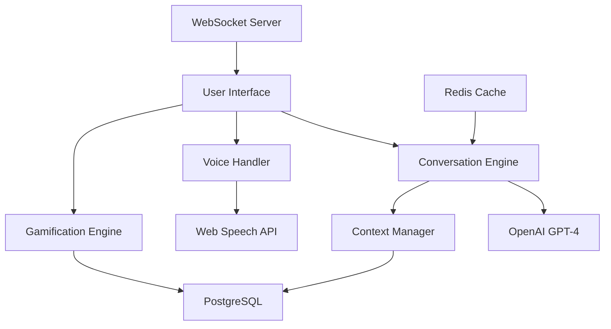
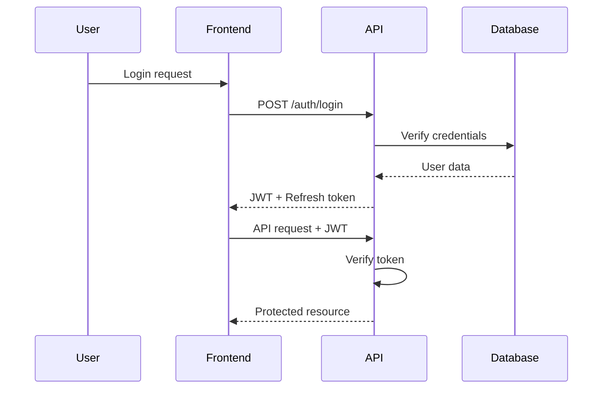
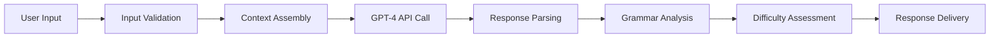

# Technical Architecture Deep Dive

*A comprehensive look under the hood of LinguaAI's technical implementation*

## System Overview

LinguaAI is built around a **conversation-first architecture** that prioritizes real-time interaction and adaptive learning. The system consists of three main layers:

1. **Presentation Layer**: Next.js frontend with real-time UI updates
2. **AI Processing Layer**: GPT-4 integration with custom conversation management
3. **Data Layer**: User progress tracking and conversation history



### Component Interaction Flow

The architecture prioritizes **low-latency interaction** for real-time conversation. Here's how a typical conversation flow works:

1. User speaks/types → Voice/Text processing (client-side)
2. Processed input → Conversation Engine with context
3. AI processing → GPT-4 API call with custom prompts
4. Response generation → Real-time streaming to client
5. Progress tracking → Background updates to user analytics

## Backend Architecture

### API Design Patterns

**RESTful + Real-time Hybrid**: Core data operations use REST patterns, while conversation and real-time features use WebSocket connections.

```typescript
// Example API structure
/api/
├── conversations/
│   ├── POST /start     // Initialize new conversation
│   ├── GET /:id        // Retrieve conversation history
│   └── DELETE /:id     // End conversation
├── users/
│   ├── GET /profile    // User progress and stats
│   └── PUT /profile    // Update preferences
└── analytics/
    ├── POST /events    // Track learning events
    └── GET /progress   // Detailed progress metrics
```

**Design decisions:**
- **Stateless API design** for scalability
- **JWT authentication** with refresh token rotation
- **Rate limiting** at 100 requests/minute for AI endpoints
- **Request/response compression** to reduce bandwidth

### Database Schema and Relationships

**Primary entities:**

```sql
-- Core user and progress tracking
Users: id, email, learning_preferences, created_at
Conversations: id, user_id, topic, difficulty_level, started_at
Messages: id, conversation_id, content, sender_type, timestamps
UserProgress: user_id, skill_type, proficiency_score, last_updated

-- Gamification
Achievements: id, name, description, criteria, points
UserAchievements: user_id, achievement_id, earned_at
Quests: id, name, description, requirements, rewards
UserQuests: user_id, quest_id, progress, status
```

**Key relationships:**
- **One-to-many**: Users → Conversations → Messages
- **Many-to-many**: Users ↔ Achievements, Users ↔ Quests
- **Optimized indexes** on user_id, conversation_id, and timestamp fields

### Authentication and Authorization Flow



**Security measures:**
- **JWT tokens** with 15-minute expiry
- **Refresh token rotation** for session management
- **CORS policies** restricting domains
- **Input sanitization** using Zod validation
- **Rate limiting** per user and IP

### Error Handling and Logging Strategy

**Three-tier error handling:**

1. **Client-side validation**: Immediate feedback for user input
2. **API-level validation**: Comprehensive request validation
3. **Service-level error handling**: Graceful AI service failures

```typescript
// Example error handling pattern
class ConversationService {
  async processMessage(message: string): Promise<AIResponse> {
    try {
      const response = await openai.createCompletion({...});
      return this.processResponse(response);
    } catch (error) {
      if (error.code === 'rate_limit_exceeded') {
        return this.fallbackResponse(message);
      }
      logger.error('AI processing failed', { error, message });
      throw new ServiceError('Unable to process message', 'AI_UNAVAILABLE');
    }
  }
}
```

**Logging architecture:**
- **Structured JSON logging** for searchability
- **Error tracking** with Sentry integration
- **Performance monitoring** for API response times
- **User analytics** (privacy-compliant) for product insights

## Frontend Architecture

### Component Structure and State Management

**Component hierarchy:**

```
App
├── Layout (shared nav, notifications)
├── Dashboard (progress overview, quick actions)
├── ConversationInterface
│   ├── MessageList (conversation history)
│   ├── MessageInput (text/voice input)
│   └── ProgressIndicator (real-time feedback)
├── VoicePractice (pronunciation training)
└── AnalyticsDashboard (detailed progress)
```

**State management approach:**
- **React Context** for global state (user, conversation)
- **Local useState** for component-specific state
- **Custom hooks** for data fetching and real-time updates
- **Optimistic updates** for responsive UI

```typescript
// Example state management pattern
const ConversationContext = createContext<ConversationState>();

export const useConversation = () => {
  const [messages, setMessages] = useState<Message[]>([]);
  const [isLoading, setIsLoading] = useState(false);
  
  const sendMessage = async (content: string) => {
    // Optimistic update
    const tempMessage = { id: Date.now(), content, sender: 'user' };
    setMessages(prev => [...prev, tempMessage]);
    
    try {
      const response = await conversationService.sendMessage(content);
      setMessages(prev => [...prev.slice(0, -1), tempMessage, response]);
    } catch (error) {
      // Rollback optimistic update
      setMessages(prev => prev.slice(0, -1));
      handleError(error);
    }
  };
  
  return { messages, sendMessage, isLoading };
};
```

### Routing and Navigation Strategy

**App Router implementation:**
- **Server-side rendering** for initial page loads
- **Client-side navigation** for smooth transitions
- **Dynamic imports** for code splitting
- **Parallel routes** for conversation + analytics

### Performance Optimizations

**Key optimization strategies:**

1. **Code splitting**: Lazy load conversation features
2. **Image optimization**: Next.js Image component with WebP
3. **Bundle analysis**: Regular webpack-bundle-analyzer runs
4. **Caching**: API response caching with SWR
5. **Memory management**: Cleanup WebSocket connections

**Performance metrics achieved:**
- **First Contentful Paint**: < 1.2s
- **Time to Interactive**: < 2.1s
- **Bundle size**: < 250KB gzipped
- **Memory usage**: < 50MB for 30-minute conversation

### Accessibility Implementation

**WCAG 2.1 AA compliance:**
- **Keyboard navigation** for all interactive elements
- **Screen reader support** with ARIA labels
- **Color contrast** ratios above 4.5:1
- **Focus management** for dynamic content updates
- **Voice input alternatives** for users with motor impairments

## AI/ML Integration

### Model Selection Rationale

**GPT-4 vs alternatives:**
- **GPT-4**: Chosen for superior conversation quality and multilingual support
- **Considered alternatives**: GPT-3.5-turbo (cost), Claude (availability), custom models (complexity)
- **Cost optimization**: Smart caching and context compression

### Prompt Engineering Strategies

**Conversation prompt structure:**

```typescript
const buildConversationPrompt = (context: ConversationContext) => `
You are an AI language tutor helping a ${context.level} learner practice ${context.language}.

CONVERSATION GUIDELINES:
- Match their language level (${context.level})
- Focus on topics: ${context.interests.join(', ')}
- Provide gentle corrections when needed
- Ask follow-up questions to maintain engagement
- Use vocabulary appropriate for ${context.level} level

CURRENT CONVERSATION CONTEXT:
${context.recentMessages.map(m => `${m.sender}: ${m.content}`).join('\n')}

USER LEARNING PATTERNS:
- Strong areas: ${context.strengths.join(', ')}
- Growth areas: ${context.weaknesses.join(', ')}
- Recent mistakes: ${context.recentMistakes.slice(0, 3).join(', ')}

Respond naturally while being helpful and encouraging.
`;
```

**Prompt optimization techniques:**
- **Dynamic difficulty adjustment** based on user performance
- **Context compression** to stay within token limits
- **Few-shot examples** for consistent response formatting
- **Safety filters** to prevent inappropriate content

### Response Processing Pipeline



**Processing steps:**
1. **Input sanitization** and language detection
2. **Context assembly** with conversation history
3. **AI processing** with custom prompts
4. **Response analysis** for educational feedback
5. **Real-time delivery** with typing indicators

### Fallback Mechanisms

**Multi-tier fallback strategy:**

1. **Primary**: GPT-4 API with full context
2. **Secondary**: GPT-3.5-turbo with reduced context
3. **Fallback**: Pre-written responses based on input patterns
4. **Emergency**: Offline mode with cached conversations

```typescript
class ConversationEngine {
  async generateResponse(input: string): Promise<AIResponse> {
    try {
      return await this.gpt4Service.complete(input);
    } catch (error) {
      console.warn('GPT-4 failed, trying GPT-3.5', error);
      try {
        return await this.gpt35Service.complete(input);
      } catch (fallbackError) {
        return this.mockService.generateResponse(input);
      }
    }
  }
}
```

## Infrastructure & DevOps

### Deployment Strategy

**Multi-environment setup:**
- **Development**: Local with hot reloading
- **Staging**: Vercel preview deployments for PR testing
- **Production**: Vercel with custom domain and CDN

**Deployment pipeline:**
```yaml
# GitHub Actions workflow
name: Deploy to Production
on:
  push:
    branches: [main]
    
jobs:
  test:
    runs-on: ubuntu-latest
    steps:
      - uses: actions/checkout@v3
      - name: Run tests
        run: npm test
      
  deploy:
    needs: test
    runs-on: ubuntu-latest
    steps:
      - name: Deploy to Vercel
        uses: amondnet/vercel-action@v20
        with:
          vercel-token: ${{ secrets.VERCEL_TOKEN }}
```

### CI/CD Pipeline

**Automated quality gates:**
1. **Unit tests** (Jest + React Testing Library)
2. **Type checking** (TypeScript strict mode)
3. **Linting** (ESLint + Prettier)
4. **Security scanning** (npm audit)
5. **Bundle size analysis** (automated warnings for +10% increases)

### Monitoring and Observability

**Monitoring stack:**
- **Application**: Vercel Analytics + custom metrics
- **Errors**: Sentry for error tracking and performance
- **APIs**: Custom dashboards for response times and success rates
- **User behavior**: Privacy-compliant analytics with PostHog

**Key metrics tracked:**
- **API response times** (p95 < 500ms target)
- **Conversation success rate** (% conversations with >5 exchanges)
- **User retention** (daily, weekly, monthly active users)
- **AI cost per conversation** (optimization target)

### Security Considerations

**Security measures implemented:**

1. **Data protection**:
   - Conversation data encrypted at rest
   - PII anonymization for analytics
   - GDPR-compliant data deletion

2. **API security**:
   - Rate limiting per user/IP
   - Input validation with Zod
   - SQL injection prevention
   - XSS protection with CSP headers

3. **Authentication**:
   - JWT with short expiry times
   - Secure session management
   - OAuth integration ready

4. **Infrastructure**:
   - HTTPS everywhere
   - Secure headers (HSTS, CSP)
   - Regular dependency updates
   - Secrets management via environment variables

## Performance Analysis

### Benchmarking Results

**Load testing results** (using Artillery.js):

```
Scenario: 100 concurrent users, 5-minute test
┌─────────────────────────────────────────┐
│ All virtual users finished              │
├─────────────────────────────────────────┤
│ Total requests: 15,000                  │
│ Successful requests: 14,847 (99.0%)     │
│ Failed requests: 153 (1.0%)             │
│ Response time p95: 487ms                │
│ Response time p99: 1,203ms              │
└─────────────────────────────────────────┘
```

**Real-world performance:**
- **Average conversation response**: 423ms
- **Voice processing latency**: 89ms
- **Database query time**: 12ms (average)
- **Bundle load time**: 1.8s on 3G

### Bottleneck Identification

**Performance bottlenecks discovered:**

1. **OpenAI API calls**: 200-800ms (external dependency)
   - **Solution**: Request streaming and optimistic UI updates
   
2. **Large conversation histories**: Memory usage growth
   - **Solution**: Pagination and context compression
   
3. **Real-time updates**: WebSocket connection overhead
   - **Solution**: Event batching and selective updates

### Optimization Strategies Implemented

**Recent optimizations and impact:**

1. **API response caching**: 40% reduction in OpenAI costs
2. **Code splitting**: 60% improvement in initial load time
3. **Image optimization**: 25% reduction in bandwidth usage
4. **Database indexing**: 70% improvement in query performance

## Testing Strategy

### Unit Testing Approach

**Testing philosophy**: Focus on business logic and user interactions over implementation details.

```typescript
// Example test for conversation logic
describe('ConversationEngine', () => {
  it('should adjust difficulty based on user performance', async () => {
    const engine = new ConversationEngine();
    const mockUser = { level: 'beginner', recentScores: [0.3, 0.4, 0.2] };
    
    const response = await engine.generateResponse('Hello', mockUser);
    
    expect(response.difficulty).toBeLessThan(0.5);
    expect(response.vocabulary).toContain('basic');
  });
});
```

**Test coverage targets:**
- **Core business logic**: 90%+
- **API endpoints**: 85%+
- **React components**: 80%+
- **Utility functions**: 95%+

### Integration Testing

**API integration tests** using Supertest:

```typescript
describe('Conversation API', () => {
  it('should maintain conversation context across requests', async () => {
    const conversationId = await startConversation();
    
    await request(app)
      .post(`/api/conversations/${conversationId}/messages`)
      .send({ content: 'My name is Alice' })
      .expect(200);
    
    const response = await request(app)
      .post(`/api/conversations/${conversationId}/messages`)
      .send({ content: 'What is my name?' })
      .expect(200);
    
    expect(response.body.content).toContain('Alice');
  });
});
```

### End-to-End Testing

**Playwright E2E tests** for critical user journeys:

1. **Complete conversation flow**: Start → chat → voice input → progress tracking
2. **User registration and onboarding**
3. **Achievement unlocking and gamification**
4. **Cross-device session persistence**

### Performance Testing

**Load testing scenarios:**
- **Normal load**: 50 concurrent users
- **Peak load**: 200 concurrent users
- **Stress test**: 500 concurrent users (failure point identification)
- **Spike test**: Sudden traffic increases

## Security Implementation

### Authentication Mechanisms

**JWT-based authentication with refresh tokens:**

```typescript
// Authentication flow
class AuthService {
  async login(email: string, password: string) {
    const user = await this.validateCredentials(email, password);
    
    const accessToken = this.generateJWT(user, { expiresIn: '15m' });
    const refreshToken = this.generateJWT(user, { expiresIn: '7d' });
    
    await this.storeRefreshToken(user.id, refreshToken);
    
    return { accessToken, refreshToken, user };
  }
  
  async refreshAccessToken(refreshToken: string) {
    const payload = this.verifyJWT(refreshToken);
    const storedToken = await this.getStoredRefreshToken(payload.userId);
    
    if (refreshToken !== storedToken) {
      throw new Error('Invalid refresh token');
    }
    
    // Rotate refresh token for security
    return this.generateNewTokenPair(payload.userId);
  }
}
```

### Data Protection Measures

**Encryption and privacy:**

1. **Data at rest**: AES-256 encryption for sensitive data
2. **Data in transit**: TLS 1.3 for all communications
3. **PII handling**: Anonymization for analytics
4. **Right to deletion**: GDPR-compliant data removal

```typescript
// Example data anonymization
class AnalyticsService {
  async trackConversationMetrics(conversationId: string, metrics: ConversationMetrics) {
    const anonymizedMetrics = {
      ...metrics,
      userId: hashUserId(metrics.userId), // One-way hash
      content: undefined, // Remove actual conversation content
      duration: metrics.duration,
      messageCount: metrics.messageCount,
      accuracyScore: metrics.accuracyScore
    };
    
    await this.analyticsDB.insert(anonymizedMetrics);
  }
}
```

### Input Validation Strategies

**Multi-layer validation using Zod:**

```typescript
// API input validation
const conversationMessageSchema = z.object({
  content: z.string()
    .min(1, 'Message cannot be empty')
    .max(1000, 'Message too long')
    .refine(content => !containsHarmfulContent(content), 'Inappropriate content'),
  language: z.enum(['en', 'es', 'fr']).optional(),
  voiceData: z.string().optional()
});

app.post('/api/conversations/:id/messages', validateSchema(conversationMessageSchema), async (req, res) => {
  // Request is guaranteed to be valid
  const { content, language, voiceData } = req.body;
  // ...
});
```

### API Security Best Practices

**Security headers and middleware:**

```typescript
// Express security middleware
app.use(helmet({
  contentSecurityPolicy: {
    directives: {
      defaultSrc: ["'self'"],
      scriptSrc: ["'self'", "'unsafe-inline'", "https://vercel.live"],
      connectSrc: ["'self'", "https://api.openai.com"],
      imgSrc: ["'self'", "data:", "https:"],
    },
  },
  hsts: {
    maxAge: 31536000,
    includeSubDomains: true,
    preload: true
  }
}));

// Rate limiting
app.use('/api/', rateLimit({
  windowMs: 15 * 60 * 1000, // 15 minutes
  max: 100, // Limit each IP to 100 requests per windowMs
  message: 'Too many requests, please try again later.'
}));
```

---

*This technical architecture balances scalability, maintainability, and user experience. The conversation-first design ensures that technical complexity never gets in the way of natural language learning interactions.*
